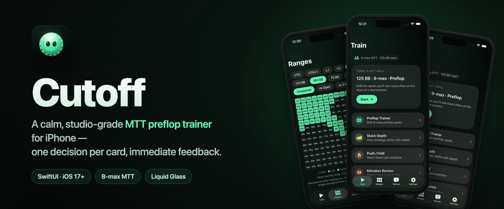
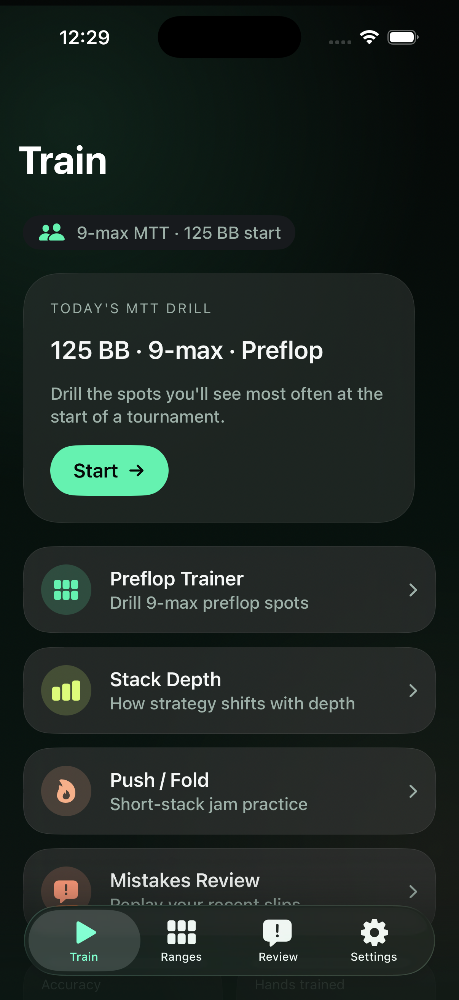
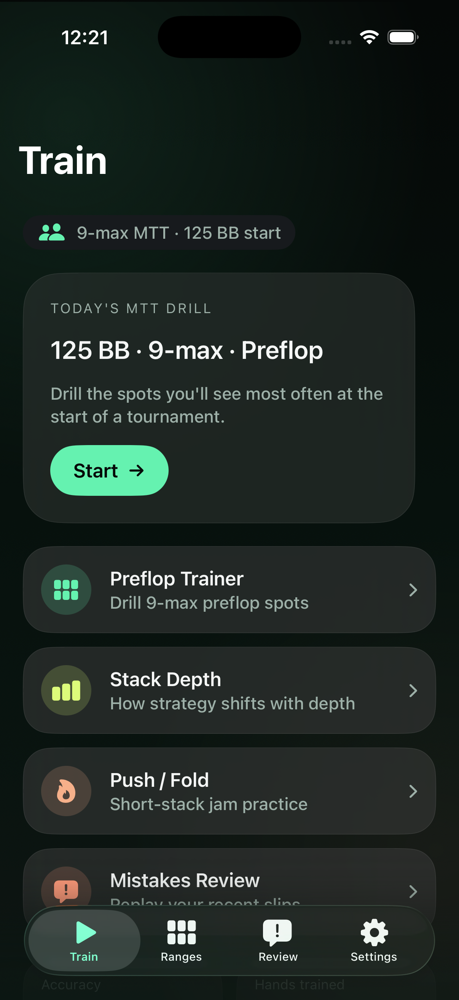
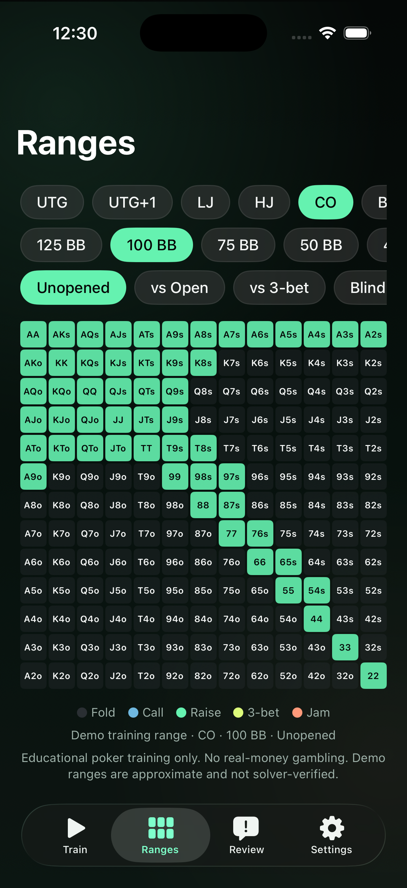
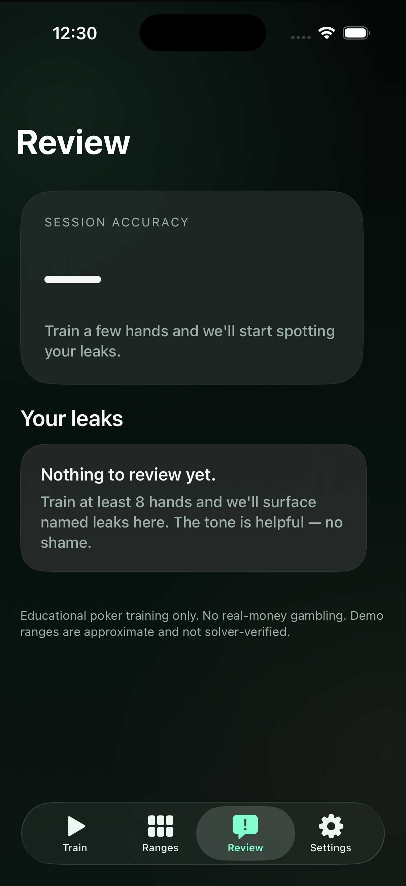
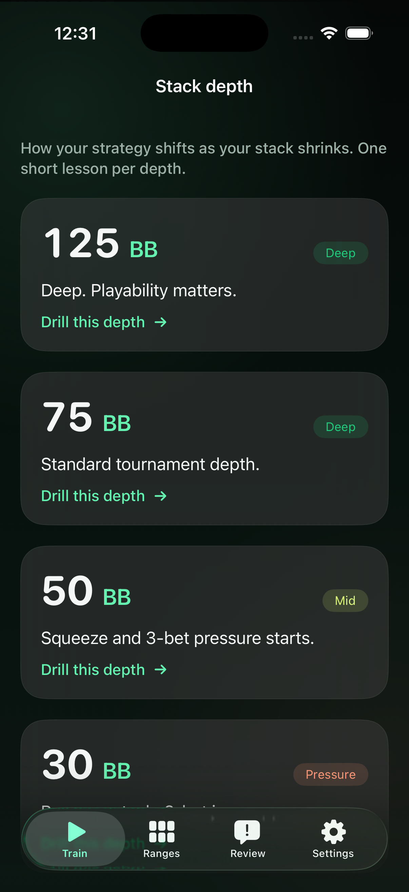
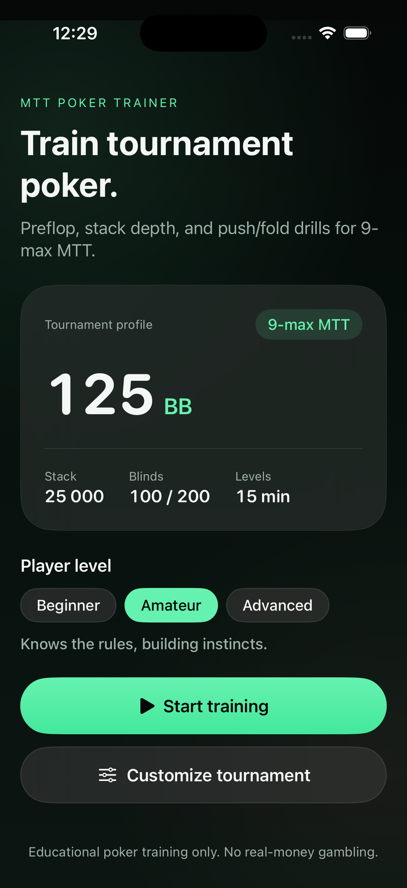

<p align="center">
  
</p>

# Cutoff

A calm, studio-grade iPhone trainer for No-Limit Texas Hold'em **multi-table tournament** preflop decisions. Built in SwiftUI for iOS 17+, dark-mode forced, Liquid Glass on iOS 18.

> Educational training only. No real money, no play money, no live-table assistance. Bundled ranges are published community charts (RangeConverter / poker.academy free charts), rounded and adapted for study — not the output of a live solver.

See [`CHANGELOG.md`](CHANGELOG.md) for release notes.

---

## Screens

<p align="center">
  
  
  
</p>
<p align="center">
  
  
  
</p>

---

## What it is

- **Preflop drills** — 8-max MTT spots (9-max derived by adaptation), one decision per card, immediate feedback in plain English.
- **Stack-depth lessons** — discrete buckets at 100 / 80 / 70 / 60 / 50 / 40 / 35 / 30 / 25 / 20 / 15 / 10 BB so the player builds depth-specific instinct.
- **Push/fold trainer** — short-stack jam ranges from every position.
- **13×13 range browser** — filter by position, depth, opponent, and action; tap a cell to see the mixed-strategy frequencies.
- **Leak review** — names the player's recurring mistakes in human language ("you over-defend the BB vs UTG opens at 30bb") and routes back to drilling them.
- **Strategy guide** — a chapter-based MTT preflop walkthrough with per-chapter progress (Russian-language content; English shows a not-supported notice).
- **Standard routine** — a single tap pulls a random mix of preflop spots across positions and depths for a balanced rep.

## What it isn't

- Not a gambling app — no real money, no play money, no buy-ins, no chips.
- Not a live-table assistant — no in-hand coaching, no opponent profiling.
- Not a solver — bundled ranges are published study charts (rounded, ChipEV), not live GTO output.

## Design principles

1. **Decision-first, explanation second.** The action the player must take is always front-and-center; the *why* comes after they commit.
2. **Bite-sized over comprehensive.** A session is a 60-second loop. Density is welcome only where it accelerates that loop.
3. **Calm darkness, never casino darkness.** Mint / emerald / peach on a deep neutral — a studio lamp at 11pm, never felt under a tournament chip.
4. **Tokens only.** `AppColors`, `AppSpacing` (8-pt grid), `AppRadius`, `AppTypography`, `AppMotion`, `AppGlass`. No hardcoded values.
5. **Accessibility is non-negotiable.** WCAG 2.1 AA contrast, Dynamic Type up to `accessibility3`, `reduceMotion`/`reduceTransparency` honored, color is never the only signal.

## Stack

- SwiftUI + MVVM with `@Observable`
- `SwiftData` for `QuizResult` / `TrainingSession`, `UserDefaults` for config
- ~1,930 per-chart JSON ranges in `Cutoff/Resources/Ranges/`; each chart carries `source` provenance and a `spot` block (position, opponent, facing, depth, ante)
- No backend, no third-party dependencies
- Liquid Glass `@available(iOS 18, *)` with `.ultraThinMaterial` fallback

Layout:

```
Cutoff/
├── Theme/          design tokens + localization
├── Components/     PrimaryButton, glass surfaces, poker table, range grid cells…
├── Models/         RangeChart, TrainingSpot, StackDepthBucket, TournamentConfig…
├── Logic/          RangeLoader, RangeService, SpotMatrix…
├── Persistence/    SwiftData stores
├── Features/       Onboarding, Train, Ranges, Review, Strategy, Settings
└── Resources/Ranges/  bundled range JSONs
```

## Build

Requires Xcode 17+ and `xcodegen` (`brew install xcodegen`).

```sh
xcodegen generate
open Cutoff.xcodeproj
```

Or from the command line:

```sh
xcodebuild -project Cutoff.xcodeproj \
  -scheme Cutoff \
  -destination 'platform=iOS Simulator,name=iPhone 17' \
  build test
```

## Range data

The bundled charts are built from published community charts (RangeConverter / poker.academy free charts). Two tools under `Tools/RangeImporter/` produce the JSON the app loads:

- **`scripts/scrape_all_ranges.py`** — bulk-scrapes the poker.academy tournament library, clicking through each opponent position and saving raw charts to `staging/poker_academy_charts/`.
- **`RangeImporter`** (Swift CLI) — converts crib-sheet CSVs into the bundled range JSON schema, deriving the filename and 9-max siblings (`NineMaxAdapter`).

Every emitted chart records its `source` (publisher, product, URL, solver assumptions) and a `spot` block (position, opponent position, facing action, stack depth, ante type), so the app can label and match charts precisely. `scripts/validate_ranges.py` gates the bundled JSONs. See [`docs/DATA_PROVENANCE.md`](docs/DATA_PROVENANCE.md).

## Documentation

| File | What it covers |
| --- | --- |
| [`docs/PRODUCT_PLAN.md`](docs/PRODUCT_PLAN.md) | Product spec, users, MVP scope |
| [`docs/UX_RESEARCH.md`](docs/UX_RESEARCH.md) | Mobile UX principles applied |
| [`docs/DESIGN_RESEARCH.md`](docs/DESIGN_RESEARCH.md) | Apple HIG + Liquid Glass notes |
| [`docs/DESIGN_SYSTEM.md`](docs/DESIGN_SYSTEM.md) | Tokens, components, rules |
| [`docs/DATA_PROVENANCE.md`](docs/DATA_PROVENANCE.md) | Where the bundled ranges come from |
| [`docs/APP_STORE_COMPLIANCE.md`](docs/APP_STORE_COMPLIANCE.md) | Review-risk checklist |
| [`docs/IMPLEMENTATION_PLAN.md`](docs/IMPLEMENTATION_PLAN.md) | Phased build order |
| [`CLAUDE.md`](CLAUDE.md) | Engineering & compliance ground rules |

## Status

Private, in active development. Not on the App Store.
